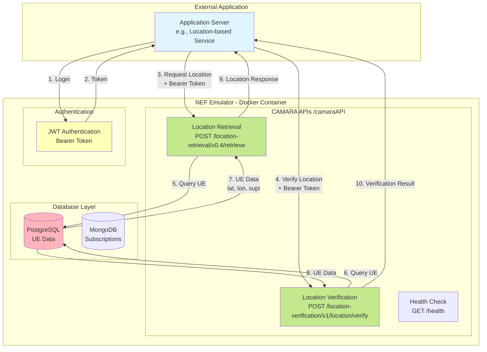
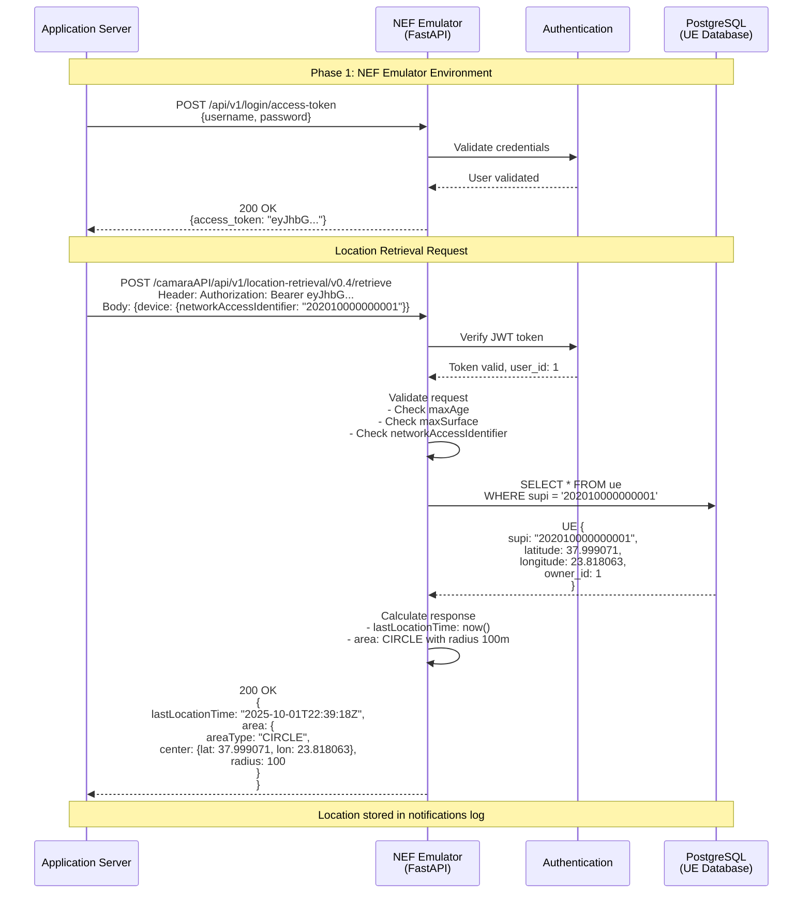
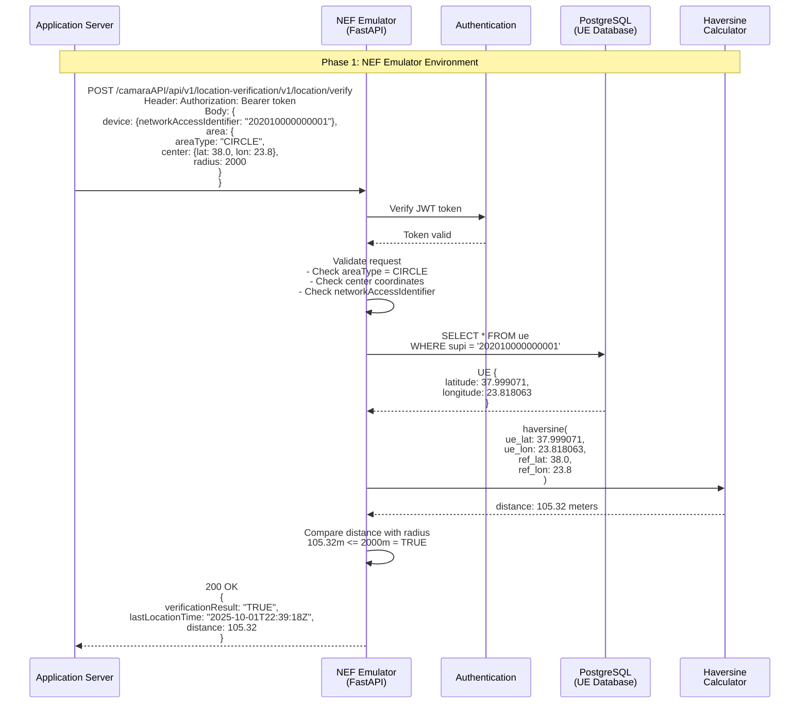
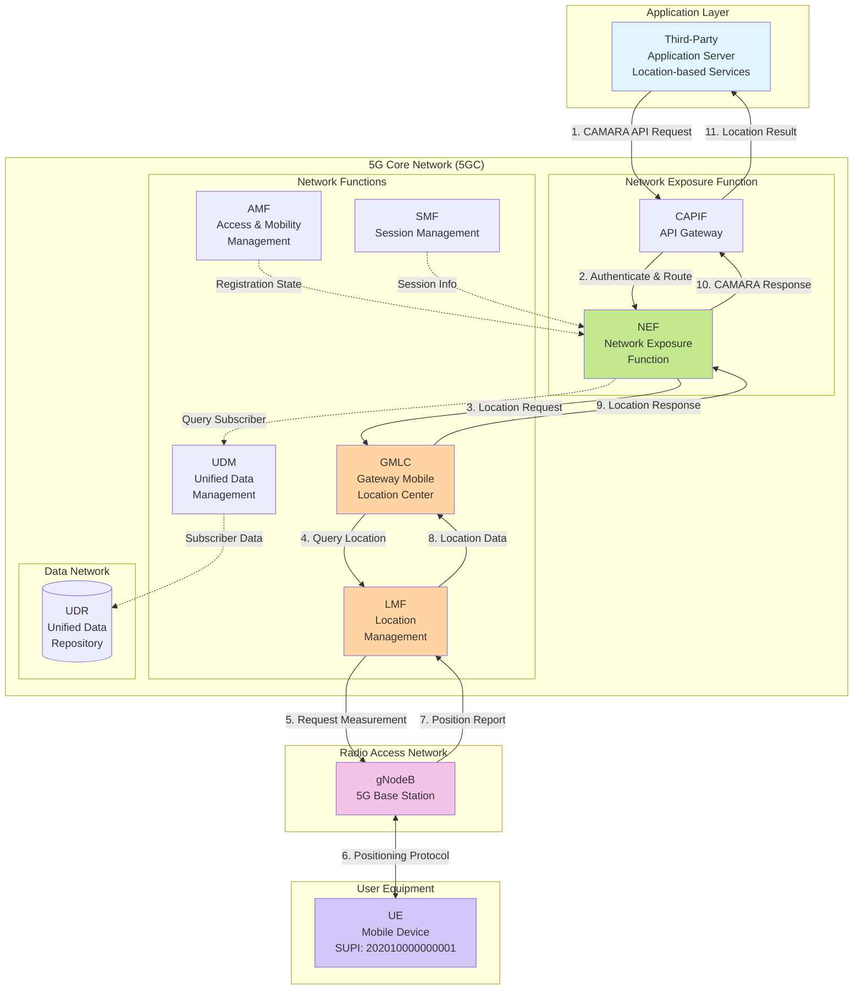
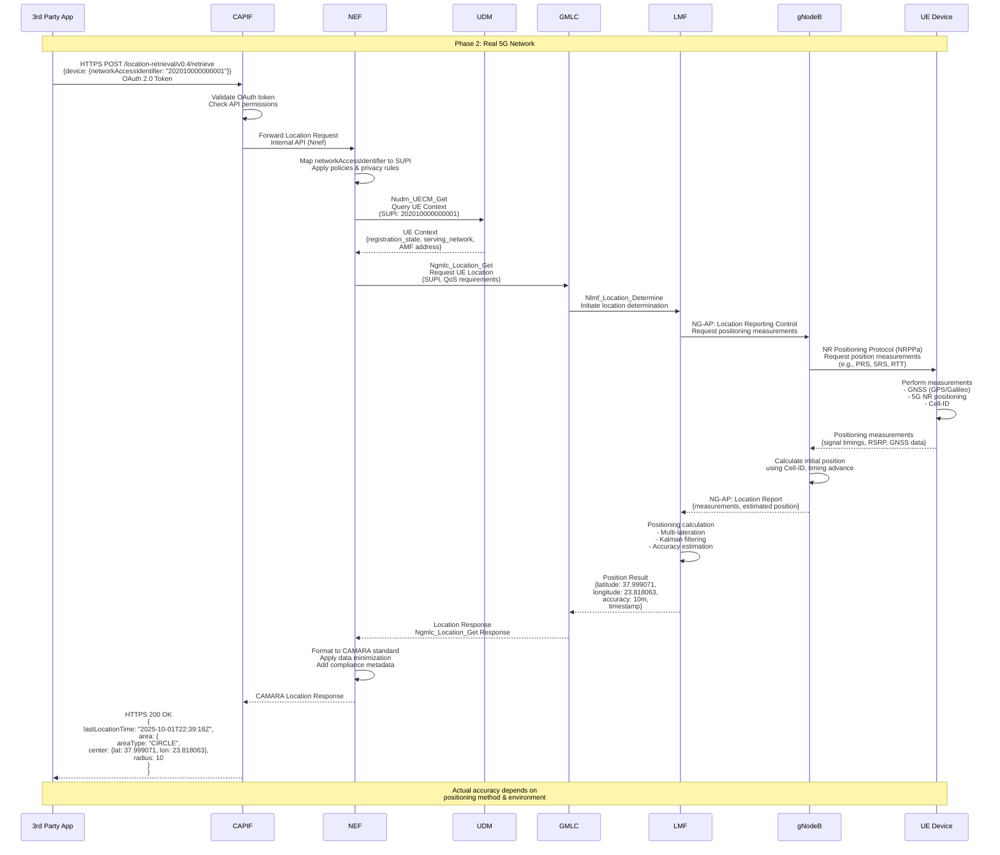
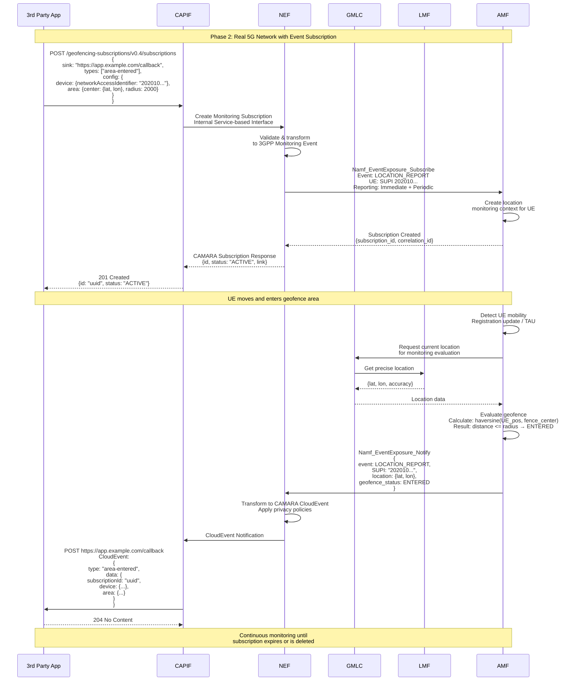
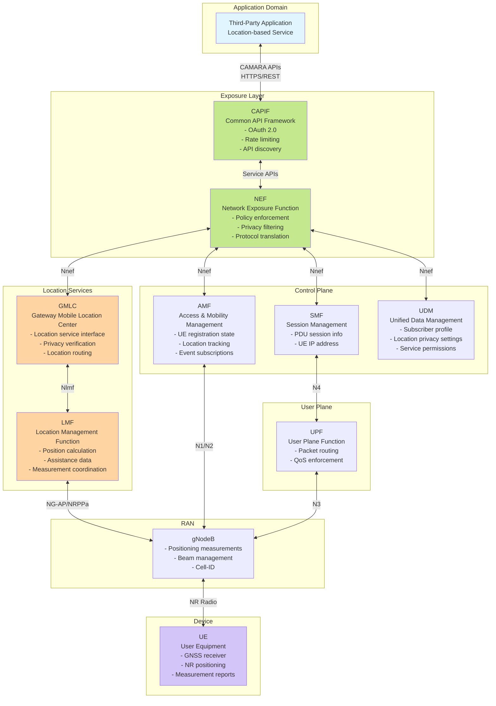
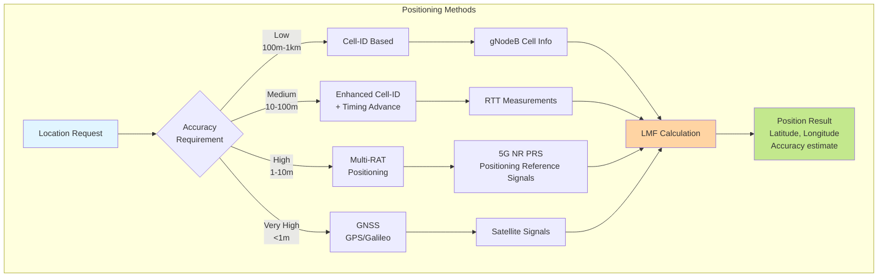

# Device Location APIs - Architecture Documentation

## Table of Contents
- [Phase 1: NEF Emulator Environment](#phase-1-nef-emulator-environment)
  - [Architecture Overview](#architecture-overview)
  - [Location Retrieval Flow](#location-retrieval-flow)
  - [Location Verification Flow](#location-verification-flow)
  - [Data Flow Diagram](#data-flow-diagram)
- [Phase 2: Real-World 5G Network](#phase-2-real-world-5g-network)
  - [Real 5G Network Architecture](#real-5g-network-architecture)
  - [Real-World Location Retrieval](#real-world-location-retrieval)
  - [Real-World Geofencing with Events](#real-world-geofencing-with-events)
  - [Network Function Interactions](#network-function-interactions)
  - [Positioning Methods](#positioning-methods-in-real-5g)
- [Key Differences](#key-differences)
- [API Endpoints Summary](#api-endpoints-summary)

---

## Phase 1: NEF Emulator Environment

### Architecture Overview



### Location Retrieval Flow



### Location Verification Flow



### Data Flow Diagram

```mermaid
graph LR
    subgraph "Input"
        REQ[API Request<br/>networkAccessIdentifier:<br/>"202010000000001"]
    end
    
    subgraph "NEF Emulator Processing"
        AUTH[Authentication<br/>Verify Bearer Token]
        VAL[Validation<br/>Check Parameters]
        CRUD[CRUD Layer<br/>crud.ue.get_supi]
        CALC[Calculation<br/>Haversine / Response]
        LOG[Logging<br/>ReportLogging]
    end
    
    subgraph "Storage"
        PG[(PostgreSQL<br/>UE Table)]
        MG[(MongoDB<br/>Notifications)]
    end
    
    subgraph "Output"
        RESP[API Response<br/>Location / Verification]
    end
    
    REQ --> AUTH
    AUTH --> VAL
    VAL --> CRUD
    CRUD --> PG
    PG --> CALC
    CALC --> RESP
    CALC --> LOG
    LOG --> MG
    
    style REQ fill:#e1f5ff
    style RESP fill:#c3e88d
    style PG fill:#ffb3ba
    style MG fill:#ffb3ba
```

---

## Phase 2: Real-World 5G Network

### Real 5G Network Architecture



### Real-World Location Retrieval



### Real-World Geofencing with Events



### Network Function Interactions



### Positioning Methods in Real 5G



---

## Key Differences

| Aspect | Phase 1 (NEF Emulator) | Phase 2 (Real 5G Network) |
|--------|------------------------|---------------------------|
| **Location Source** | Static PostgreSQL database | Real-time positioning (GNSS, NR, Cell-ID) |
| **Accuracy** | Fixed 100m radius | Variable (1m - 1km) based on method |
| **Network Functions** | Single FastAPI application | Multiple 5GC NFs (NEF, AMF, GMLC, LMF, etc.) |
| **Protocols** | HTTP/REST only | Service-based interfaces (SBI), NG-AP, NRPPa |
| **Authentication** | Simple JWT | OAuth 2.0 + CAPIF + Network policies |
| **Real-time Updates** | Thread-based monitoring | Event-based subscriptions via AMF |
| **Privacy** | Basic owner_id check | Multi-layer privacy (UDM policies, NEF filtering, GDPR) |
| **Latency** | ~10-50ms | ~100-500ms (depends on positioning method) |
| **Scalability** | Single container | Distributed microservices |
| **Standards** | CAMARA API spec | CAMARA + 3GPP TS 23.502, 23.273, 38.305 |

---

## API Endpoints Summary

### NEF Emulator Endpoints

#### 1. Location Retrieval
- **Endpoint**: `POST /camaraAPI/api/v1/location-retrieval/v0.4/retrieve`
- **Description**: Returns current device location from database
- **Authentication**: JWT Bearer Token
- **Request Body**:
```json
{
  "device": {
    "networkAccessIdentifier": "202010000000001"
  },
  "maxAge": 60,
  "maxSurface": null
}
```
- **Response**:
```json
{
  "lastLocationTime": "2025-10-01T22:39:18Z",
  "area": {
    "areaType": "CIRCLE",
    "center": {
      "latitude": 37.999071,
      "longitude": 23.818063
    },
    "radius": 100
  }
}
```

#### 2. Location Verification
- **Endpoint**: `POST /camaraAPI/api/v1/location-verification/v1/location/verify`
- **Description**: Verifies if device is within specified area
- **Authentication**: JWT Bearer Token
- **Request Body**:
```json
{
  "device": {
    "networkAccessIdentifier": "202010000000001"
  },
  "area": {
    "areaType": "CIRCLE",
    "center": {
      "latitude": 38.0,
      "longitude": 23.8
    },
    "radius": 2000
  }
}
```
- **Response**:
```json
{
  "verificationResult": "TRUE",
  "lastLocationTime": "2025-10-01T22:39:18Z",
  "distance": 105.32
}
```

#### 3. Health Check
- **Endpoint**: `GET /camaraAPI/api/v1/health`
- **Description**: Returns API health status
- **Authentication**: None required
- **Response**:
```json
{
  "status": "healthy",
  "apis": [
    "Location Retrieval v0.4",
    "Location Verification v1",
    "Geofencing Subscriptions v0.4"
  ],
  "integration": "NEF-Emulator",
  "timestamp": "2025-10-01T22:39:18Z"
}
```

---

## Implementation Details

### NEF Emulator Limitations

1. **Fixed Accuracy**: Always returns 100m radius (NEF-Emulator doesn't calculate actual positioning accuracy)
2. **Database-Only**: Location data comes from PostgreSQL, not real network measurements
3. **CIRCLE Only**: Only supports circular geofence areas (per CAMARA spec simplification)
4. **networkAccessIdentifier Only**: Only supports SUPI/IMSI identifier (no phone number, IP address, etc.)
5. **Thread-Based Monitoring**: Uses Python threading instead of event-driven architecture

### Real 5G Network Capabilities

1. **Dynamic Accuracy**: Varies from sub-meter (GNSS) to kilometer (Cell-ID) based on method
2. **Real-Time Positioning**: Active measurements from UE and gNodeB
3. **Multiple Positioning Methods**:
   - **Cell-ID**: Based on serving cell (100m-1km accuracy)
   - **Enhanced Cell-ID**: + Timing Advance (10-100m)
   - **OTDOA/RTT**: Multi-lateration using multiple gNodeBs (1-10m)
   - **GNSS**: GPS/Galileo/BeiDou integration (sub-meter)
   - **Hybrid**: Combination of methods for optimal accuracy
4. **Privacy & Policy Enforcement**: Multi-layer checks (UDM subscriber settings, NEF policies, GDPR compliance)
5. **Event-Driven**: AMF provides real-time notifications on mobility events

---

## References

### CAMARA Project
- **GitHub**: https://github.com/camaraproject/DeviceLocation
- **API Spec**: Device Location v0.4
- **OpenAPI**: https://github.com/camaraproject/DeviceLocation/blob/main/code/API_definitions/geofencing-subscriptions.yaml

### 3GPP Standards
- **TS 23.502**: Procedures for the 5G System (5GS)
- **TS 23.273**: 5G System (5GS) Location Services (LCS)
- **TS 38.305**: Stage 2 functional specification of User Equipment (UE) positioning in NG-RAN
- **TS 29.522**: 5G System; Network Exposure Function Northbound APIs

### NEF Emulator
- **Repository**: https://github.com/5gasp/NEF-Emulator
- **Documentation**: See `/docs` folder in repository

---

## Usage Examples

### Example 1: Get UE Location

```bash
# 1. Login and get token
curl -X POST "http://192.168.56.131:8888/api/v1/login/access-token" \
  -H "Content-Type: application/x-www-form-urlencoded" \
  -d "username=admin@example.com&password=admin"

# Response: {"access_token": "eyJhbGc...", "token_type": "bearer"}

# 2. Request location
curl -X POST "http://192.168.56.131:8888/camaraAPI/api/v1/location-retrieval/v0.4/retrieve" \
  -H "Authorization: Bearer eyJhbGc..." \
  -H "Content-Type: application/json" \
  -d '{
    "device": {
      "networkAccessIdentifier": "202010000000001"
    }
  }'
```

### Example 2: Verify UE in Area

```bash
curl -X POST "http://192.168.56.131:8888/camaraAPI/api/v1/location-verification/v1/location/verify" \
  -H "Authorization: Bearer eyJhbGc..." \
  -H "Content-Type: application/json" \
  -d '{
    "device": {
      "networkAccessIdentifier": "202010000000001"
    },
    "area": {
      "areaType": "CIRCLE",
      "center": {
        "latitude": 37.999071,
        "longitude": 23.818063
      },
      "radius": 2000
    }
  }'
```

---

## License

This documentation is part of the NEF-Emulator project.

**Last Updated**: October 19, 2025
